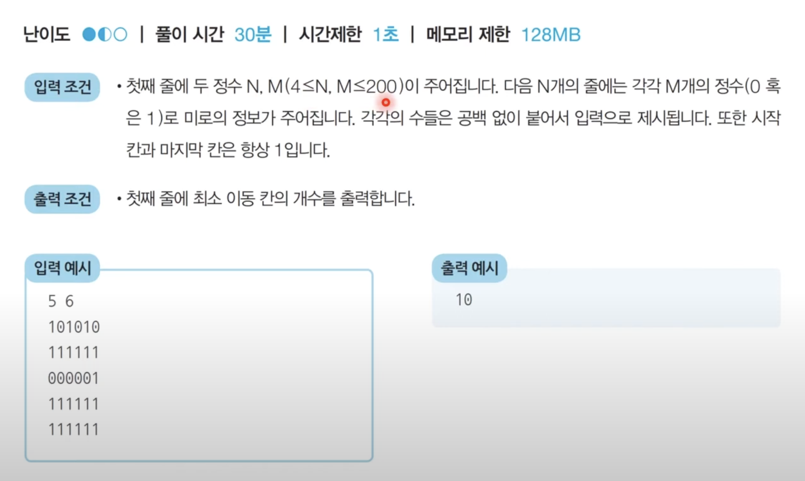
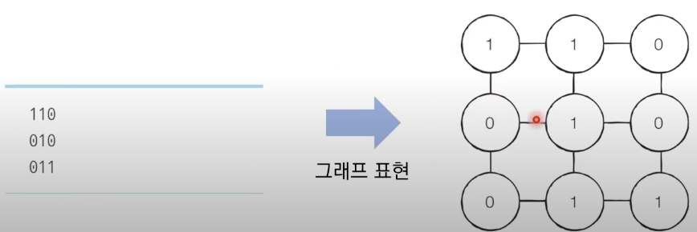
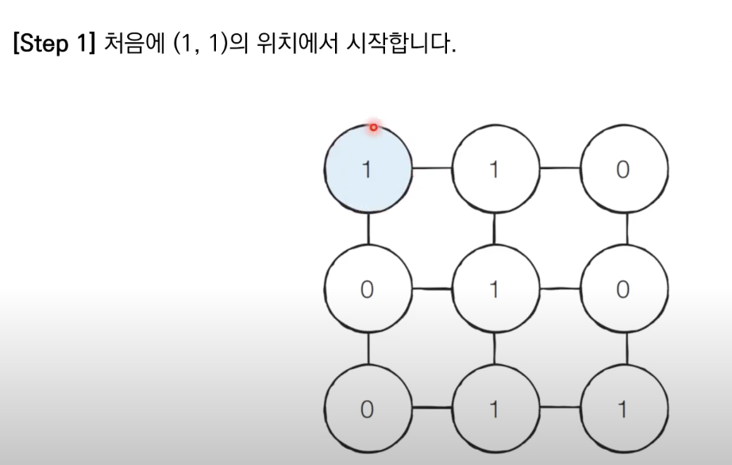
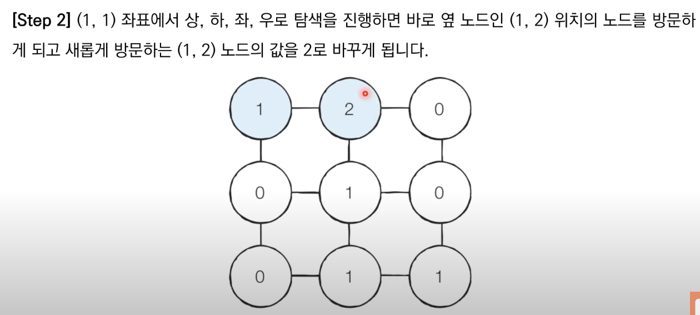

# 넓이 우선 탐색(BFS_Breadth First Search)

## 01 덱의 특징:

1. **순서적 탐색**: 그래프나 트리와 같은 자료구조에서 노드를 순서대로 탐색하는 알고리즘.
2. **균일한 레벨**: 한 노드로부터 동일한 레벨에 있는 모든 노드를 먼저 방문한 후 다음 레벨로 이동.
3. **큐 (Queue) 사용**: 큐 자료구조를 활용하여 구현됨. 먼저 방문한 노드를 큐에 넣고, 큐에서 노드를 꺼내어 탐색을 진행함.

## 02 덱의 구현:

- 파이썬에서 collections 모듈의 deque 클래스를 사용하여 BFS 구현 가능.

```
from collections import deque

def bfs(graph, start):
    visited = set()  # 방문한 노드를 저장하는 집합
    queue = deque()  # 큐 생성
    queue.append(start)  # 시작 노드를 큐에 추가

    while queue:
        node = queue.popleft()  # 큐에서 노드 꺼내기
        if node not in visited:
            visited.add(node)  # 노드를 방문 처리
            print(node)  # 노드 방문 순서 출력
            neighbors = graph[node]  # 인접한 노드들 가져오기
            for neighbor in neighbors:
                if neighbor not in visited:
                    queue.append(neighbor)  # 큐에 인접한 노드들 추가
```

## 03 연습:

> 1.  미로 탈출: 문제 설명

> 동빈이는 N X M 크기의 직사각형 형태의 미로에 갇혔습니다. 미로에는 여러 마리의 괴물이 있어 이를 피해 탈출해야 합니다.
> 동빈이의 위치는 (1, 1)이며 미로의 출구는 (N, M)의 위치에 존재하며 한 번에 한 칸씩 이동할 수 있습니다. 이때 괴물이 있는 부분은 0으로, 괴물이 없는 부분은 1로 표시되어 있습니다. 미로는 반드시 탈출할 수 있는 형태로 제시됩니다.
> 이때 동빈이가 탈출하기 위해 움직여야 하는 최소 칸의 개수를 구하세요. 칸을 셀 때는 시작 칸과 마지막 칸을 모두 포함해서 계산합니다.
> 

> 2.  문제 풀이
>     2-00. BFS
>     2-01. 시작 지점에서 가까운 노드부터 차례대로 그래프의 모든 노드 탐색. (1, 1) 지점부터 BFS를 수행하여 모든 노드의 최단 거리 값을 기록하여 해결.





```
from collections import deque

# N, M을 공백을 기준으로 구분하여 입력 받기
n, m = map(int, input().split())

# 2차원 리스트의 맵 정보 입력 받기
graph = []
for i in range(n):
  graph.append(list(map(int, input())))

# 이동할 네 가지 방향 정의 (상, 하, 좌, 우)
dx = [-1, 1, 0, 0]
dy = [0, 0, -1, 1]

# BFS를 수행한 결과 출력
print(result)


# BFS 소스코드 구현
def bfs(x, y):
  # 큐(Queue) 구현을 위해 deque 라이브러리 사용
  queue = deque()
  queue.append((x,y))
  # 큐가 빌 때까지 반복하기
  while queue:
    x, y = queue.popleft()
    for i in range(4):
      nx = x + dx[i]
      ny = y + dy[i]
      # 미로 찾기 공간을 벗어난 경우 무시
      if nx < 0 or nx >= n or ny < 0 or ny >= m:
        continue
      # 벽인 경우 무시
      if graph[nx][ny] == 0:
        continue
      # 해당 노드를 처음 방문하는 경우에만 최단 거리 기록
      if graph[nx][ny] == 1:
        graph[nx][ny] = graph[x][y] + 1
        queue.append((nx, ny))


```

<hr/>

## 04 덱의 활용:

BFS은 주로 다음과 같은 상황에서 활용됨.

- **최단 경로 탐색**: 시작점으로부터 목적지까지의 최단 경로를 찾을 때 사용됨.
- **그래프의 연결 여부 확인**: 그래프 내에서 두 노드 간의 연결 여부를 확인할 때 사용됨.
- **격자나 맵에서의 탐색**: 격자나 맵에서 특정 위치에서 시작하여 목표 위치까지의 최단 경로를 탐색할 때 활용됨.
