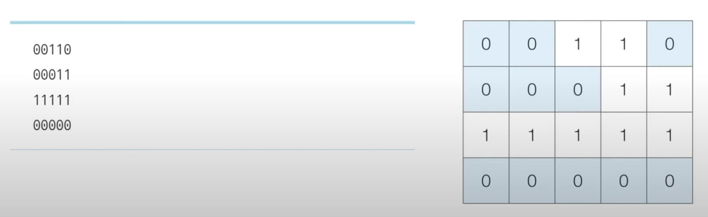
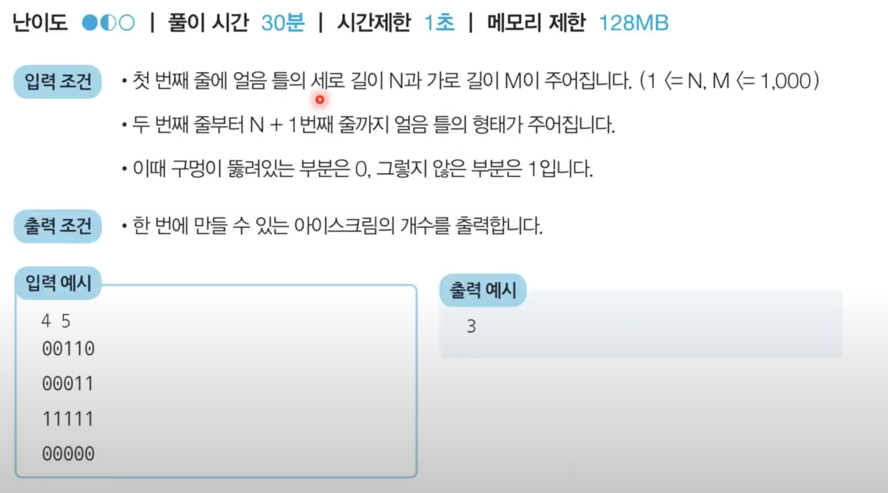

# 깊이 우선 탐색 (DFS - Depth First Search)

## 01 DFS의 특징:

1. **깊이 우선**: DFS는 한 경로를 최대한 깊게 탐색함. 즉, 한 분기점에서 모든 자식 노드를 탐색한 후 다음 형제 노드로 이동함.
2. **재귀 또는 스택**: DFS는 재귀 함수 또는 스택 자료구조를 사용하여 구현됨.
3. **백트래킹**: DFS는 특정 경로가 유효하지 않을 경우 백트래킹하여 이전 경로로 돌아감.

## 02 DFS의 구현:

- 주로 재귀 함수나 스택을 사용하여 DFS 구현 가능.

1. 재귀 함수를 사용한 구현:

```
def dfs(graph, node, visited):
    if node not in visited:
        print(node)  # 노드 방문 순서 출력
        visited.add(node)  # 노드를 방문 처리
        for neighbor in graph[node]:
            dfs(graph, neighbor, visited)  # 인접한 노드에 대해 재귀 호출
```

2. 스택을 사용한 구현:

```
def dfs(graph, start):
    visited = set()  # 방문한 노드를 저장하는 집합
    stack = [start]  # 스택 생성 및 시작 노드 추가

    while stack:
        node = stack.pop()  # 스택에서 노드 꺼내기
        if node not in visited:
            visited.add(node)  # 노드를 방문 처리
            print(node)  # 노드 방문 순서 출력
            neighbors = graph[node]  # 인접한 노드들 가져오기
            for neighbor in neighbors:
                if neighbor not in visited:
                    stack.append(neighbor)  # 스택에 인접한 노드들 추가
```

## 03 연습:

> 1.  음료수 얼려 먹기: 문제 설명

> N X M 크기의 얼음 틀이 있습니다. 구멍이 뚫려 있는 부분은 0, 칸막이가 존재하는 부분은 1로 표시됩니다. 구멍이 뚫려 있는 부분끼리 상, 하, 좌, 우로 붙어 있는 경우 서로 연결되어 있는 것으로 간주합니다. 이때 얼음 틀의 모양이 주어졌을 때 생성되는 총 아이스크림 개수를 구하는 프로그램을 작성하세요. 다음의 4 X 5 얼음 틀 예시에서는 아이스크림이 총 3개 생성됩니다.
>  > 

> 2.  문제 풀이
>     2-00. DFS
>     2-01. 특정한 지점의 주변 상, 하, 좌, 우를 살펴본 후 주변 지점 중 값이 '0'이면서 아직 방문하지 않은 지점이 있다면 방문.
>     2-02. 방문한 지점에서 다시 상, 하, 좌, 우를 살펴보면서 방문을 진행하는 과정 반복. (=> 연결된 모든 지점 방문 가능)
>     2-03. 모든 노드에 대하여 1 ~ 2번의 과정을 반복하며, 방문하지 않은 지점의 수를 카운트.

```
# N, M을 공백을 기준으로 구분하여 입력 받기
n, m = map(int, input().split())

# 2차원 리스트의 맵 정보 입력 받기
graph = []
for i in range(n):
  graph.append(list(map(int, input())))

# 모든 노드(위치)에 대하여 음료수 채우기
result = 0
for i in range(n):
  for j in range(m):
    # 현재 위치에서 DFS 수행
    if dfs(i, j) == True:
      result += 1

print(result) # 정답 출력


# DFS로 특정 노드를 방문하고 연결된 모든 노드들도 방문
def dfs(x, y):
  # 주어진 범위를 벗어나는 경우에는 즉시 종료
  if x <= -1 or x >= n or y <= -1 or y >= m:
    return False
  # 현재 노드를 아직 방문하지 않았다면
  if graph[x][y] == 0:
    graph[x][y] = 1
    # 상, 하, 좌, 우의 위치들도 모두 재귀적으로 호출
    dfs(x - 1, y)
    dfs(x, y - 1)
    dfs(x + 1, y)
    dfs(x, y + 1)
    return True
  return False
```

## 04 DFS의 활용:

DFS는 주로 다음과 같은 상황에서 활용됨.

- **깊이 우선 탐색**: 그래프 또는 트리에서 모든 가능한 경로를 탐색하거나 특정 조건을 만족하는 경로를 찾을 때 사용됨.
- **백트래킹**: 조건을 만족하는 해를 찾거나 모든 조합을 탐색할 때 사용됨.
- **그래프의 연결성 확인**: 그래프 내에서 노드 간의 연결 여부를 확인하거나 사이클을 탐지할 때 사용됨.
